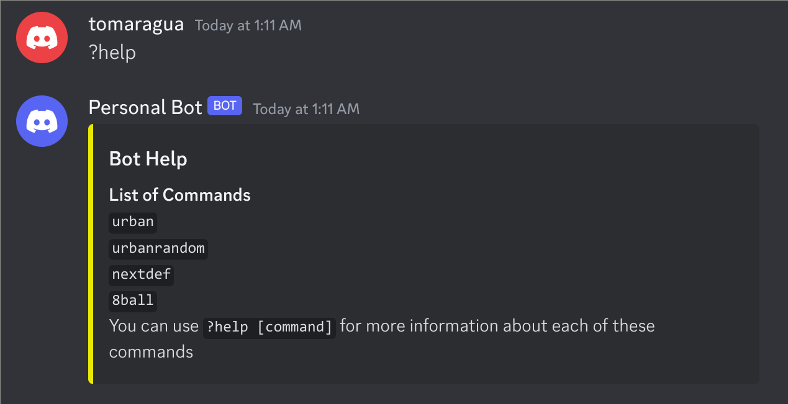
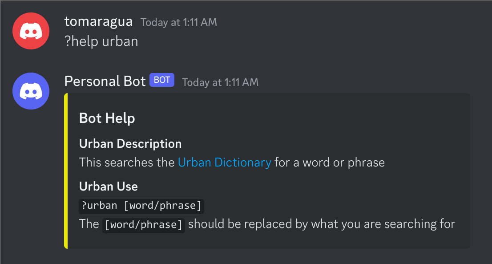
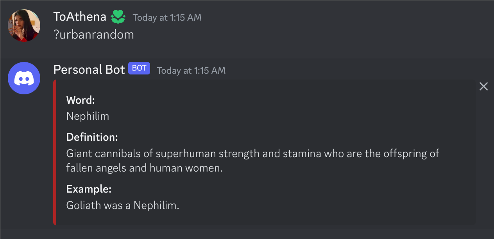
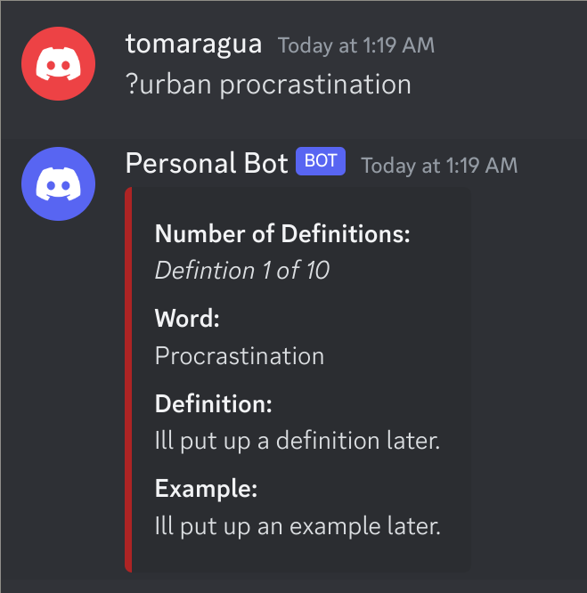
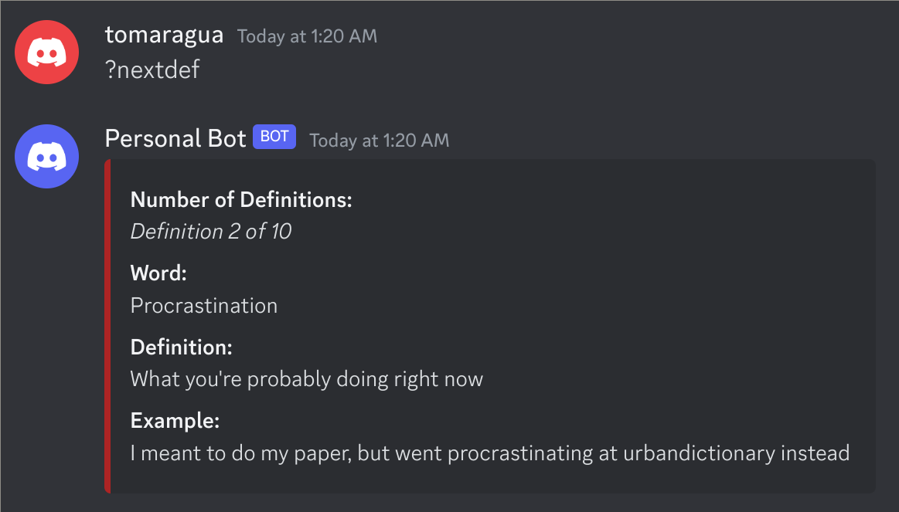
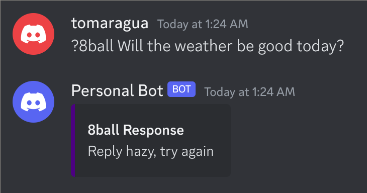
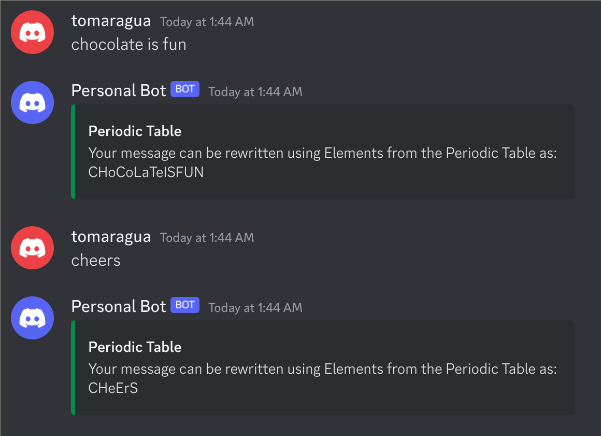

# Discord Bot
A Discord Bot with various features to make Discord servers more fun and interesting.

---
# Installation
The bot can be setup by follow these steps:

1. Follow the steps on [this website](https://discordpy.readthedocs.io/en/stable/discord.html) to create your discord bot.
2. Run this command to clone the repository:

    ```
    git clone https://github.com/SomethingRandomIDK/FunDiscordBot.git
    ```

3. Create a .env file based on the .env.example file, copying your discord bot token from step 1. in this file.

**NOTE:** It is recommended that you setup a python virtual environment before running your bot to prevent unexpected behavior. Visit [this link](https://www.freecodecamp.org/news/how-to-setup-virtual-environments-in-python/) for instructions on how to setup a virtual environment.

4. Go through the config.json and configure the bot to your preference.

5. Enter the folder for the discord bot and run the following commands to run the bot:

    ```
    pip install -r requirements.txt
    ```
    ```
    python3 bot.py
    ```

---
# Features
## Help
This bot has a basic help function with the default output being a list of commands available. As well as indepth help available for each of the commands with another help command.
### Commands
**help**

This command gives the list of available commands



**help** [command]

This command gives more detailed instructions about how to use the command



## Nasa
The bot can interact with the NASA database through their APIs
### Commands
**nasaSearch** [word/phrase]

This command searches for the word/phrase in NASA's image and video database and gets the closest result

**nextImg**

This command returns an alternate image for the search
### Tasks
**Astronomy Picture of the Day:**

This sends NASA's Astronomy Picture of the Day in the discord servers' system channel, on a daily basis at the time specified in the config file

## Urban Dictionary
Has a set of 3 commands to lookup words from [Urban Dictionary](https://www.urbandictionary.com)
### Commands
**urbanrandom**

This command gets a random word and shows the word, defintion, and example



**urban** [word/phrase]

This command gets the definition and example of the specified word



**nextdef**

This command gets an alternate defintion and example for the most recently searched word



## 8 Ball
This emulates the toy 8 ball.  You can ask the bot's 8 ball a question and it will give a random answer.
### Commands
**8ball** [question]

This commands generates a random answer for your question that can align with either yes, no, or maybe.



## Periodic Table Detector
Detects if the users message can be rewritten using the Elements Symbols from the Periodic Table, it ignores everything in the message except for letters.  If a message can be rewritten using the Periodic Table, the bot shows how the message would be rewritten.


